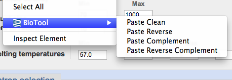

# BioTool

> A Chrome extension for biologists.

## Overview

BioTool is a Chrome extension for biologists. It provides basic sequence
manipulation for pasting into text fields. When dealing with sequences there is
often an annoying middle step of pasting a sequence into a complement or
reverse complement utility. This extension eliminates that step.

    

It is intended to be lightweight and fast. It doesn't parse anything on the
clipboard until you ask it to, meaning it won't slow down your regular
browsing. It only scans sequences once for all actions, so it should stay fast
even if your sequences get big.

## Operations

All paste events "clean" the sequence. This removes digits, leaves whitespace,
and accepts any of the characters actguACTGU. If any other characters are
present, it pastes "unrecognized base: x", where x is the offending character.
Removing digits is intended to play nice with formats like GenBank, which
[include numbers](http://www.ncbi.nlm.nih.gov/nuccore/NC_000083.6?report=genbank&from=35506032&to=35510777), and those like fasta [that do not](http://www.ncbi.nlm.nih.gov/nuccore/NC_000083.6?report=fasta&log$=seqview&from=35506032&to=35510777).

All operations expect a sequence to have been copied to the clipboard.

### Paste Clean

Simply paste the sequence, leaving whitespace but removing digits.

### Paste Reverse

Reverse the sequence, leaving whitespace but removing digits.

### Paste Complement

Paste the complement, leaving whitespace but removing digits.

### Paste Reverse Complement

Paste the reverse complement, leaving whitespace but removing digits.

## Feedback

This functionality is what I found useful when I was working frequently with
sequences. If something is unnatural, or if something else would be useful,
contact me or open an issue!

## Chrome Extensions and the Clipboard

There are a lot of questions online about how to deal with the system clipboard
using Chrome Extensions. Such questions guided development of this extension,
and if it helped others understand copying/pasting, all the better!

## Contributing, Forking, Hacking, Messing Around

The basic structure for the extension was scaffolded using [generator chrome
extension](https://github.com/yeoman/generator-chrome-extension). Tests can be
run by serving the directory and navigating to `test/index.html`. `grunt test`
is currently failing, I believe due to some black magic with phantomjs that I
am missing, but everything passes in the browser.

The extension itself consists of an event page (`app/background.html`), in
Chrome extension terminology, and a content script
(`app/scripts/contentscript.js`).

Note that although I scaffolded the app using the generator, at least with the
early versions I'm not using the `grunt build` distribution mechanism to
produce the production code. This is mainly because there were some issues with
copying all the necessary images to the distribution directory, and because the
codebase is so small it won't make much of a difference.
